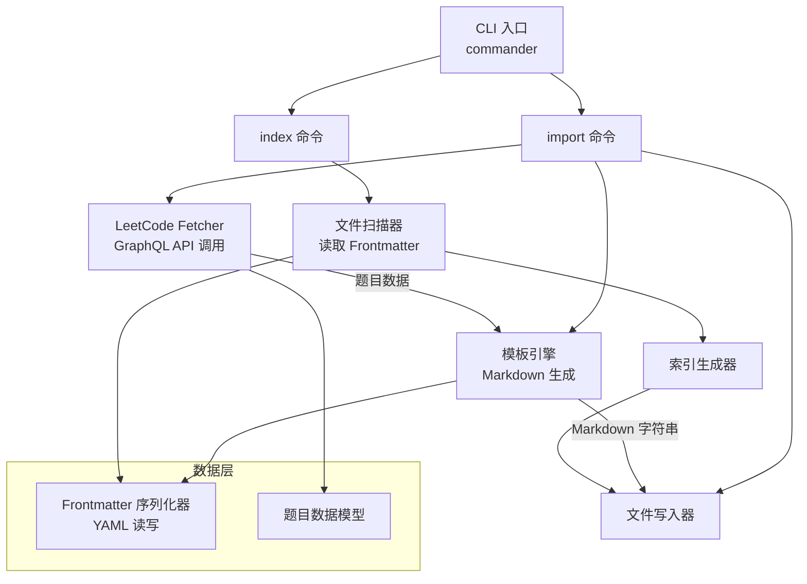

# 设计文档

## 概述

本项目是一个 Node.js 命令行工具（CLI），用于从 LeetCode 公开 GraphQL API 自动导入题目信息，生成 Obsidian 兼容的 Markdown 文件，并维护一个结构化的刷题知识库。

核心设计决策：
- **语言选择**：TypeScript — 类型安全、生态丰富，适合 CLI 工具开发
- **包管理**：npm
- **CLI 框架**：使用 `commander` 处理命令行参数
- **HTTP 请求**：使用内置 `fetch`（Node.js 18+）调用 LeetCode GraphQL API
- **模板引擎**：纯字符串拼接，无需额外依赖
- **YAML 处理**：使用 `yaml` 库进行 Frontmatter 序列化/反序列化

## 架构



系统分为以下几层：
1. **CLI 层**：解析命令行参数，调度子命令
2. **服务层**：LeetCode API 调用、模板渲染、索引生成
3. **数据层**：题目数据模型、Frontmatter 序列化

## 组件与接口

### 1. CLI 入口 (`src/cli.ts`)

使用 `commander` 注册两个子命令：

```typescript
// import <problem-id> — 导入指定题目
// index — 重新生成索引页面
```

### 2. LeetCode Fetcher (`src/fetcher.ts`)

负责调用 LeetCode 公开 GraphQL API 获取题目数据。

```typescript
interface FetchResult {
  success: boolean;
  data?: LeetCodeProblem;
  error?: string;
}

async function fetchProblem(questionId: string): Promise<FetchResult>;
```

GraphQL 查询端点：`https://leetcode.com/graphql`

查询字段：`questionId`, `title`, `titleSlug`, `difficulty`, `topicTags`, `content`

### 3. 模板引擎 (`src/template.ts`)

将题目数据渲染为完整的 Markdown 文件字符串。

```typescript
function renderProblemFile(problem: ProblemMetadata, content: string): string;
```

生成的文件结构：
```markdown
---
id: 1
title: Two Sum
slug: two-sum
difficulty: easy
tags: [array, hash-table]
date: 2024-01-01
---

# 1. Two Sum

## 题目描述

[题目内容]

## 解答

### 解法一

```python
# 在此编写你的解法
```

## 笔记

- **时间复杂度**：
- **空间复杂度**：
- **关键思路**：
```

### 4. Frontmatter 序列化器 (`src/frontmatter.ts`)

处理 YAML Frontmatter 的序列化和反序列化。

```typescript
interface ProblemMetadata {
  id: number;
  title: string;
  slug: string;
  difficulty: 'easy' | 'medium' | 'hard';
  tags: string[];
  date: string;
}

function serializeFrontmatter(metadata: ProblemMetadata): string;
function parseFrontmatter(content: string): ProblemMetadata;
```

### 5. 文件写入器 (`src/writer.ts`)

负责将生成的 Markdown 写入文件系统，处理文件已存在的情况。

```typescript
interface WriteOptions {
  overwrite: boolean;
}

async function writeProblemFile(
  filePath: string, 
  content: string, 
  options: WriteOptions
): Promise<WriteResult>;
```

### 6. 索引生成器 (`src/indexer.ts`)

扫描 `problems/` 目录下所有题目文件的 Frontmatter，生成按难度和分类分组的索引页面。

```typescript
async function generateIndexes(problemsDir: string, indexesDir: string): Promise<void>;
```

生成两个索引文件：
- `indexes/by-difficulty.md` — 按 Easy/Medium/Hard 分组
- `indexes/by-category.md` — 按算法分类分组

索引使用 Obsidian 双向链接语法 `[[]]` 链接到题目文件。

## 数据模型

### ProblemMetadata

| 字段 | 类型 | 说明 |
|------|------|------|
| id | number | LeetCode 题目编号 |
| title | string | 题目标题 |
| slug | string | URL slug，用于文件命名 |
| difficulty | 'easy' \| 'medium' \| 'hard' | 难度等级 |
| tags | string[] | 分类标签列表 |
| date | string | 导入日期，格式 YYYY-MM-DD |

### LeetCodeProblem（API 响应）

| 字段 | 类型 | 说明 |
|------|------|------|
| questionId | string | 题目编号（字符串） |
| title | string | 英文标题 |
| titleSlug | string | URL slug |
| difficulty | string | 难度（"Easy"/"Medium"/"Hard"） |
| topicTags | { name: string, slug: string }[] | 分类标签 |
| content | string | 题目描述 HTML |

### Vault 目录结构

```
vault-root/
├── .obsidian/           # Obsidian 基础配置
│   └── app.json
├── problems/            # 题目文件
│   ├── 0001-two-sum.md
│   ├── 0015-3sum.md
│   └── ...
├── indexes/             # 索引页面
│   ├── by-difficulty.md
│   └── by-category.md
├── README.md            # 首页/使用说明
└── package.json         # CLI 工具配置
```


## 正确性属性

*正确性属性是系统在所有合法执行中都应保持为真的特征或行为——本质上是对系统应做什么的形式化陈述。属性是人类可读规范与机器可验证正确性保证之间的桥梁。*

### Property 1: Frontmatter 往返一致性

*For any* 合法的 ProblemMetadata 对象，将其序列化为 YAML Frontmatter 字符串，再反序列化回 ProblemMetadata 对象，应产生与原始对象等价的结果。

**Validates: Requirements 5.1, 5.2, 5.3, 4.2**

### Property 2: 模板渲染完整性

*For any* 合法的 ProblemMetadata 和题目内容字符串，渲染后的 Markdown 文件应同时包含：
- 有效的 Frontmatter 块（以 `---` 分隔）
- 题目描述内容
- `## 解答` 区域及代码块模板
- `## 笔记` 区域及复杂度提示模板
- Obsidian 双向链接语法（`[[]]`）

**Validates: Requirements 1.3, 1.4, 2.1, 2.4, 3.1, 3.3, 4.3, 5.4**

### Property 3: 文件名格式正确性

*For any* 题目编号（正整数）和 slug（非空字符串），生成的文件名应符合 `{四位编号}-{slug}.md` 格式，其中编号以零填充至四位。

**Validates: Requirements 1.2**

### Property 4: 标签完整性

*For any* 具有难度和分类标签的题目，生成的 Frontmatter 中的 tags 字段应同时包含难度标签（小写）和所有分类标签的 slug。

**Validates: Requirements 6.1, 6.2**

### Property 5: 索引生成正确性

*For any* 一组题目文件（每个文件有难度和分类标签），生成的难度索引应将每道题目归入其对应的难度分组，生成的分类索引应将每道题目归入其所有分类分组，且每道题目在每个索引中恰好出现正确的次数。

**Validates: Requirements 6.3, 6.4**

### Property 6: API 响应映射正确性

*For any* 合法的 LeetCode GraphQL API 响应对象，Fetcher 映射后的 ProblemMetadata 应包含正确的 id（数字类型）、title、slug、difficulty（小写）和 tags 列表。

**Validates: Requirements 1.1**

## 错误处理

| 场景 | 处理方式 | 相关需求 |
|------|----------|----------|
| 题目编号不存在 | 返回错误信息 "题目 {id} 不存在"，退出码 1 | 1.5 |
| 网络请求失败 | 返回错误信息 "网络请求失败: {原因}"，退出码 1 | 1.1 |
| API 响应格式异常 | 返回错误信息 "API 响应格式异常"，退出码 1 | 1.1 |
| 目标文件已存在 | 提示 "文件已存在: {路径}，使用 --force 覆盖"，默认不覆盖 | 1.6 |
| Frontmatter 解析失败 | 返回错误信息 "Frontmatter 解析失败: {原因}" | 5.2 |
| problems/ 目录不存在 | 自动创建目录 | 1.2 |
| 无写入权限 | 返回错误信息 "无法写入文件: {路径}" | 1.2 |

## 测试策略

### 测试框架

- **单元测试**：Vitest
- **属性测试**：fast-check（与 Vitest 集成）
- 每个属性测试至少运行 100 次迭代

### 属性测试（Property-Based Tests）

属性测试用于验证在所有合法输入上都成立的通用属性：

1. **Frontmatter 往返测试**
   - 生成随机 ProblemMetadata，序列化后反序列化，验证等价性
   - Tag: `Feature: leetcode-obsidian-repo, Property 1: Frontmatter round-trip consistency`

2. **模板渲染完整性测试**
   - 生成随机 ProblemMetadata 和内容字符串，渲染后验证所有必需区域存在
   - Tag: `Feature: leetcode-obsidian-repo, Property 2: Template rendering completeness`

3. **文件名格式测试**
   - 生成随机题目编号和 slug，验证文件名格式
   - Tag: `Feature: leetcode-obsidian-repo, Property 3: Filename format correctness`

4. **标签完整性测试**
   - 生成随机难度和分类标签，验证 Frontmatter tags 包含所有标签
   - Tag: `Feature: leetcode-obsidian-repo, Property 4: Tag completeness`

5. **索引生成正确性测试**
   - 生成随机题目集合，验证索引分组的正确性
   - Tag: `Feature: leetcode-obsidian-repo, Property 5: Index generation correctness`

6. **API 响应映射测试**
   - 生成随机 API 响应对象，验证映射后的字段正确性
   - Tag: `Feature: leetcode-obsidian-repo, Property 6: API response mapping correctness`

### 单元测试

单元测试用于验证具体示例和边界情况：

- **错误处理**：题目不存在、网络失败、文件已存在等场景
- **边界情况**：空标签列表、超长标题、特殊字符 slug
- **集成点**：CLI 参数解析、文件系统操作

### 测试覆盖矩阵

| 组件 | 属性测试 | 单元测试 |
|------|----------|----------|
| Frontmatter 序列化器 | Property 1 | 边界情况 |
| 模板引擎 | Property 2 | — |
| 文件名生成 | Property 3 | — |
| 标签处理 | Property 4 | — |
| 索引生成器 | Property 5 | 空目录等边界 |
| API Fetcher | Property 6 | 错误处理 |
| CLI 入口 | — | 参数解析 |
| 文件写入器 | — | 覆盖/冲突处理 |
